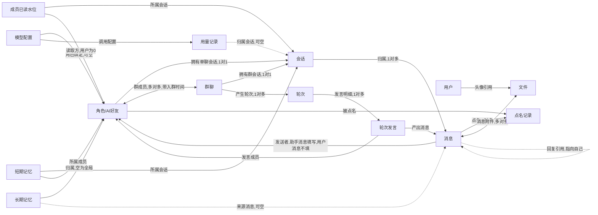
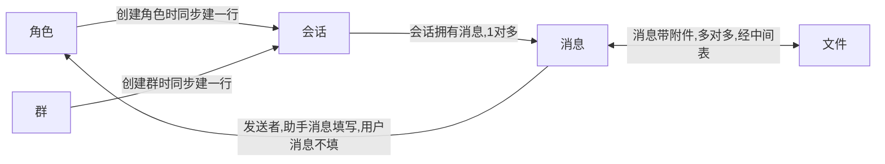
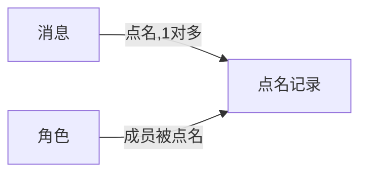
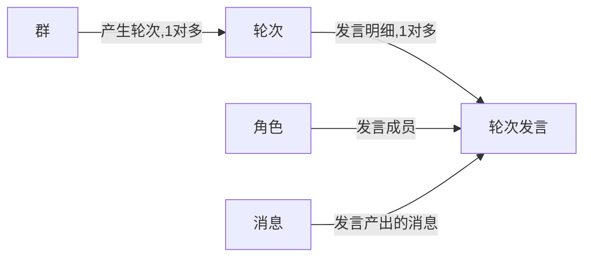
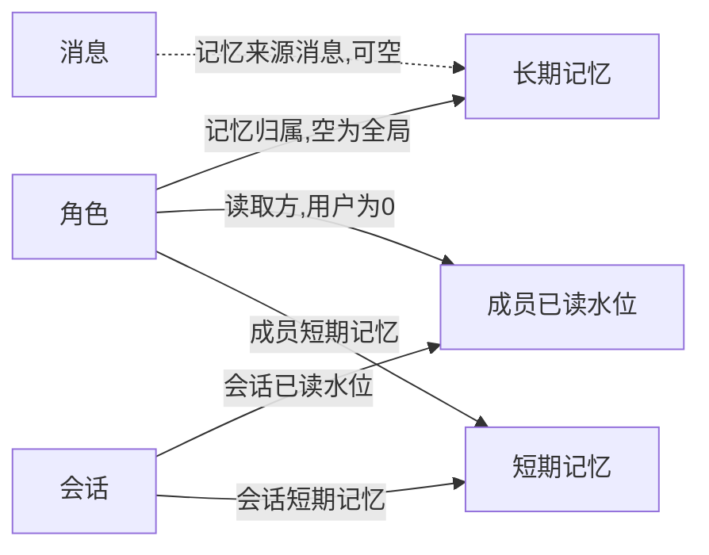
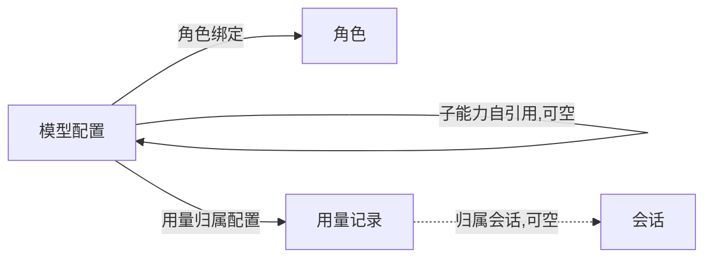

# 模型库重设计(第三版)——按 GORM 官方规范

> 状态:**已定稿,待实现**(2026-09-05 评审通过)。
> 评审结论:①删角色→记忆级联删除;②模型配置保留"子能力路由"(子配置行 + 父引用,
> 支持"文字模型遇到图片→调度图模型解读→结果回传文字模型"这类反哺);③旧 `api_profiles`
> 实体与表直接删除,不搬运数据;④键值表整表改名 `ConfigKV`,`key` 明文、`value` 加密(SecretBox)。
> 目标:消除"表难查"的根因——关联全部显式声明、外键带约束、
> 用数组当关系存的做法全部拆成可联查的表、表名列名交给框架默认策略。

## 1. 总体约定

| 项目 | 约定 |
|---|---|
| 主键 | 每个实体都带 `gorm.Model`(数字自增主键,软删除,自动维护创建/更新时间) |
| 表名 | 用框架默认规则(结构名复数转蛇形),不手写表名;个别历史表名例外 |
| 列名 | 字段名自动转蛇形,如 `CompanionID → companion_id`,不手写列名 |
| 外键 | 字段命名成对(`ConversationID` 配 `Conversation`),并写清级联/置空规则 |
| 关联 | 一对一/一对多/多对多都显式声明,列表与详情一律可整表预载 |
| 多值 | 一律拆成关系表,不用"数组塞一个列里"(点名、轮次明细等) |
| 时间 | 框架自带,实体里不再手写创建/更新时间字段 |

### 实体与文件规划

| 文件 | 实体 | 表名 | 说明 |
|---|---|---|---|
| `user.go` | `User` | `users` | 本地单用户(只有 1 行) |
| `companion.go` | `Companion` | `companions` | AI 好友/角色 |
| `group.go` | `Group`、`GroupMember` | `groups`、`group_members` | 群聊、群成员关系(带入群时间) |
| `conversation.go` | `Conversation` | `conversations` | 会话(消息归属 + 列表状态) |
| `message.go` | `Message`、`MessageMention` | `messages`、`message_mentions` | 消息、点名关系 |
| `file.go` | `File`、`MessageFile` | `files`、`message_files` | 文件登记、消息附件关系 |
| `memory.go` | `Memory` | `memories` | 长期记忆 |
| `round.go` | `Round`、`RoundSpeaker` | `rounds`、`round_speakers` | 群轮次、轮次发言明细(拆成行) |
| `short_memory.go` | `ShortMemory` | `chat_short_memories` | 短期记忆(沿用旧表名) |
| `cursor.go` | `MemberCursor` | `member_cursors` | 已读消费水位 |
| `model_config.go` | `ModelConfig` | `model_configs` | 模型/接口配置(基准实体) |
| `usage.go` | `UsageRecord` | `usage_records` | 用量账本 |
| `kv.go` | `ConfigKV` | `config_kvs` | 键值配置;`value` 列整列加密存储(SecretBox) |

### 清理(评审点 1)

- **删除** `apiprofile.go`、`session.go`,并在迁移中**删除旧表 `api_profiles`**(不搬运数据):
  `ApiProfile` 已标记废弃,和 `ModelConfig` 职责完全重复,服务层引用随提交一并改成 `ModelConfig`;
  "会话"统一由 `Conversation` 承担;会话用什么模型配置改由外键表达——
  单聊看角色上的 `model_config_id`,群聊里每个成员自己带 `model_config_id`(谁发言用谁的配置)。
- `chat_memory.go` 改名为 `short_memory.go`,表名继续用 `chat_short_memories`。

## 2. 关系全景

## 3. 逐实体设计(关系看图,字段看清单)

### 3.1 中心链路:角色 / 群 → 会话 → 消息 / 文件

字段清单:

- **角色(companions)**:自增主键;`名称/分类/一句话介绍/主题色/头像字`;
  头像文件引用(可空);绑定配置(可空,空=默认本地配置);
  人设/记忆设置/聊天风格/批次调度/主动陪伴/能力开关——这六类都是"配置值",
  继续整块存一个列里(不是关系);展示用的派生字段(未读/置顶/记忆条数等)不入库。
  关系:一对一会话;入群关系若干。
- **群(groups)**:自增主键;`群名/群公告/调度策略/最近轮次时刻`;群头像;
  成员多对多(经 `group_members`,带各自入群时间);一对一会话。
- **会话(conversations)**:自增主键;`单聊归属`(指向角色,唯一)或 `群归属`
  (指向群,唯一)二选一;置顶/静音/未读/最后活跃时间/最后一条摘要与发送者名。
  查询主路径:会话列表 = 角色/群各带出自己的会话行;
  消息页 = 找到会话行 → 按 `conversation_id` 查消息。
- **消息(messages)**:自增主键;`会话归属`(必填,会话删除级联删消息);
  方向(用户/助手);`发送者`(助手消息指向发言角色,用户消息留空);消息级已读时间;
  正文(纯文本或带引用标记);`回复引用`(指自己表,可空);
  `是否@全员`(见 3.2);点名关系若干;附件多对多(经 `message_files`,展示顺序按正文标记出现顺序)。
- **文件(files)**:自增主键;`文件名/类型/大小/相对路径`(二进制放数据目录)。

删除规则(由外键约束落实):删角色 → 级联删其会话 → 级联删消息、点名、已读水位、短期记忆、轮次发言;
删群同理;删模型配置 → 相关角色上的配置引用置空(不能删的场景由服务层拦住)。

### 3.2 点名:拆成可查的表

字段清单:

- 消息上留一个"是否@全员"开关:@全员的展开动作放在调度层做,不造"全员"伪成员行。
- 点名表:`消息` + `被点名成员` 两列做复合主键,两边都随父行删除。
- 调度查询:群里的用户消息 → 关联点名表拿到点名成员;没点名也没@全员的,按攒批逻辑处理。
- 文本解析工具(`utils/mentions.go`)输出改成"是否@全员 + 成员数字 id 列表",不再有保留字符串。

### 3.3 群轮次明细:拆成行

字段清单:

- **轮次(rounds)**:自增主键;所属群(级联删);触发时刻/结束时刻/状态/取消原因;发言明细若干。
- **轮次发言(round_speakers)**:自增主键;所属轮次、发言角色、产出消息(都级联删)。
  查"这轮谁说了什么、某成员发言史"直接关联即可。

### 3.4 记忆 / 已读 / 短期记忆

字段清单:

- **记忆(memories)**:自增主键;归属角色(空=全局记忆,删除语义见评审点 1);
  来源消息(可空,消息删了引用置空);类型/标题/正文/归属日期/来源说明/重要度/状态/索引状态。
  向量索引表保持独立,建表时用原生语句创建。
- **已读水位(member_cursors)**:`会话` + `读取方` 两列复合主键;
  读取方=0 保留给"用户"(本地单用户;助手成员从 1 起,与角色主键同一套数);
  最后一读消息编号、更新时间。
- **短期记忆(chat_short_memories)**:`成员` + `会话` 两列复合主键;
  压缩正文/期数/覆盖区间起止消息/原字数/目标字数/日期因子/压缩率/完成时刻。

### 3.5 模型配置与用量

字段清单:

- **模型配置(model_configs)**:自增主键;`唯一名/显示名/描述/版本`;
  接口地址/密钥(密文)/协议类型;温度等请求参数;
  八项能力开关(文本生成/生图/生视频/生音频/语音合成/图理解/视频理解/音频理解);
  `父配置`自引用——每个配置行都可用作其他配置的子能力执行者(子行指向主行);
  例:文字模型为主行,图片子行负责理解图片,调度层把解读结果交回主行续写(反哺,编排在智能体层)。
- **用量(usage_records)**:自增主键;服务商/模型/能力;
  会话、角色、配置三个归属引用都可空(审计维度);
  输入/输出/缓存字数、耗时、状态、估算费用、供应商请求号、错误类目。
  按日聚合需要的创建时间索引在建表时用原生语句补。

### 3.6 键值配置(加密)

**ConfigKV(config_kvs)**:主键为数字自增;`key` 唯一索引(明文,用于定位);`value` **整列加密存储**。

- 加密方案:复用本地主密钥(`utils.SecretBox`,AES-256-GCM),密文以 base64 文本落库;
  读取方一律经"解密后使用"的读写封装,内存外不出现明文值。
- 语义约束:`key` 保持明文可精确查询,但 `value` 是密文——凡涉及值的条件查询
  (极少)一律先取回解密,不做数据库内匹配;本表只承载配置类键值
  (引导状态、默认配置引用、数据版本等),不定量放热数据。
- 对应关系图:本表无任何外键关系,独立存在。

## 4. 命名与实现要点

1. 所有字段去掉手写列名(与历史库不一致的例外);去掉手写表名(只保留一个历史表名)。
2. 每一对外键写清级联规则(见 3.1 删除规则);关联字段按官方方式声明,列表/详情统一整表预载。
3. 布尔、数字这类"零值有含义"的列给出默认值约束;整块配置对象列保留序列化存储(它是值不是关系)。
4. 可空引用一律用指针类型;点名/附件/发言这类"数组"不再作为主实体的持久字段。
5. 建表迁移的实体清单按依赖顺序排(相关说明在启动初始化文件里)。

## 5. 落地影响清单(实现时处理)

| 位置 | 动作 |
|---|---|
| 服务层 | 废弃实体改名成 `ModelConfig`;会话缓存读写改成"会话行 + 整表预载";去掉对旧配置实体的依赖 |
| 智能体层(注释草稿) | 轮次参数/成员列表/点名语义按新关系表改写 |
| 文本解析工具 | 输出"是否@全员 + 成员数字列表",去掉保留字符串 |
| 初始化 | 建表清单更新;旧配置表迁移说明 |
| 测试 | 自检继续用数字 id;可新增模型命名/约束/索引自检子包 |
| 接口契约 | 旧的 `roundId`、`usageId` 这类别名由服务层契约统一映射,模型层不再管 |

## 6. 评审结论(已定稿)

1. **删角色 → 记忆**:级联删除(角色删,其记忆一并删;全局记忆不受影响)。
2. **模型配置子能力路由**:保留"子配置行 + 父引用"。普通配置行是子行,带 `parent` 指向
   主配置行(如文字模型主行);主行遇不擅长能力时,调度层按能力找子行执行,
   结果可回传主行续写(即"反哺"),编排属智能体层职责。
3. **旧 `api_profiles`**:实体删除 + 建表迁移时直接删旧表,不做数据搬运。
4. **键值表**:实体 `ConfigKV`、表 `config_kvs`;`key` 明文唯一索引,`value` 整列加密。
